# Esoter👁️cons

Cute esoteric icon-ready pngs, with eyes!!

## Gallery

| | | | |
|---|---|---|---|
| 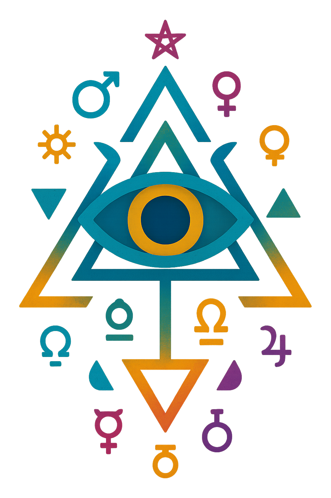 | 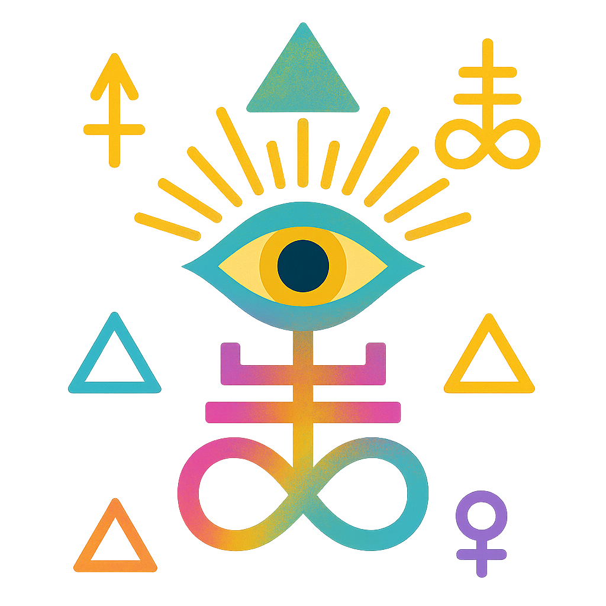 |  |  |
| **alch1** | **alch2** | **alch3** | **angelic** |
| 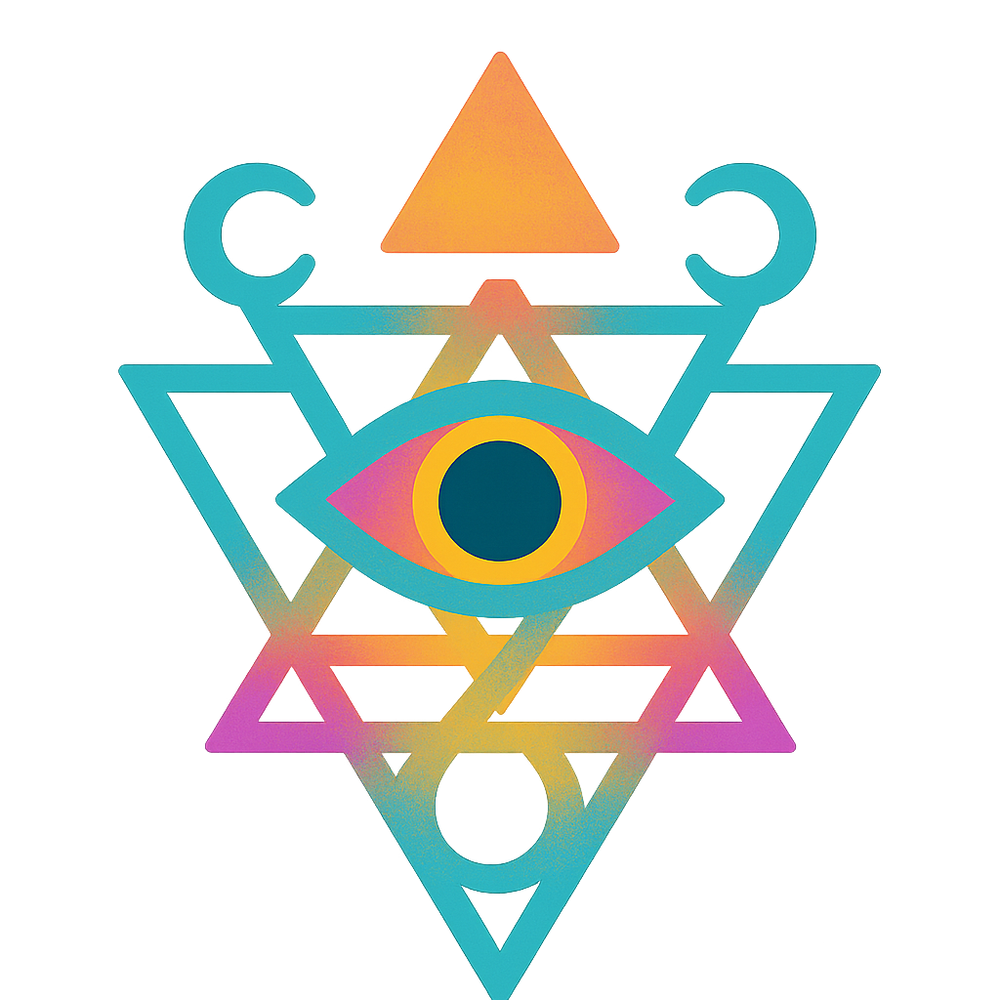 |  |  |  |
| **atlantean** | **celtic1** | **celtic2** | **cottagecore** |
| 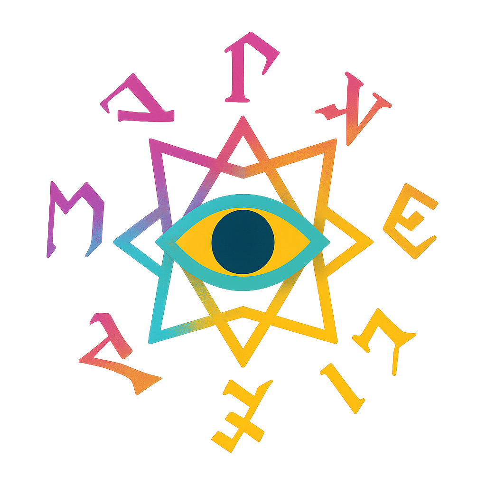 | 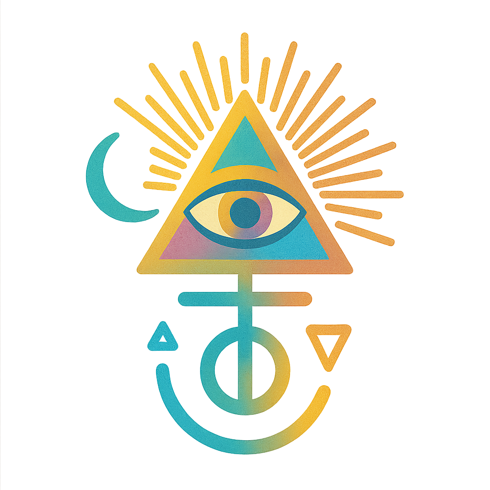 |  | 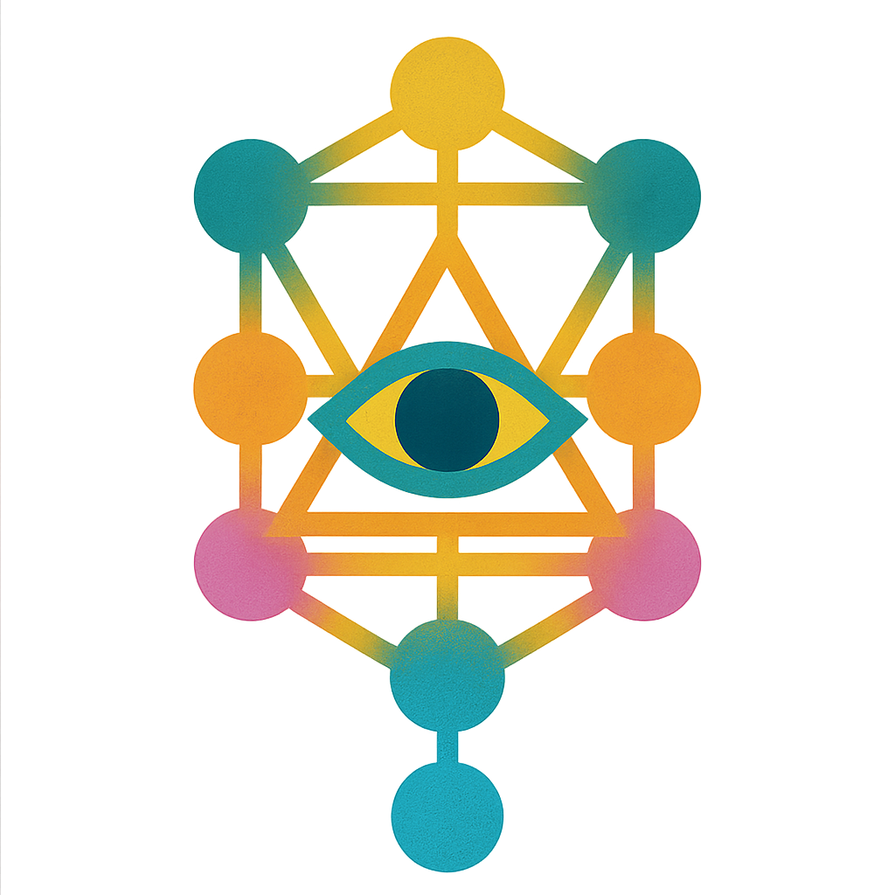 |
| **enochian** | **hermetic** | **hieroglyphic** | **kabbalah** |
|  | 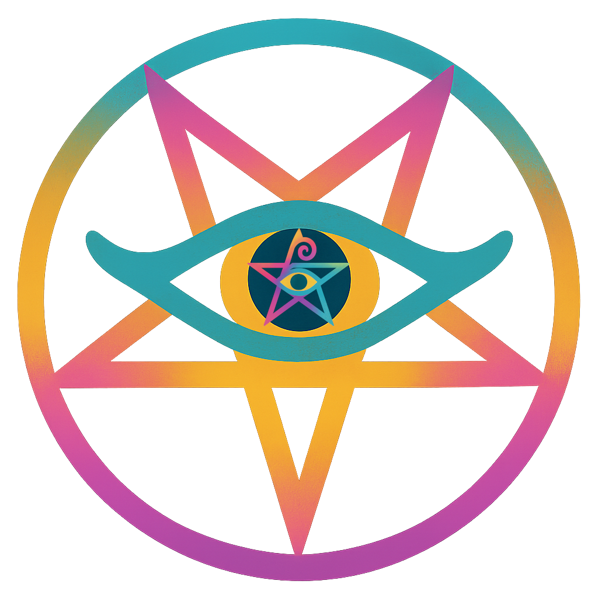 | 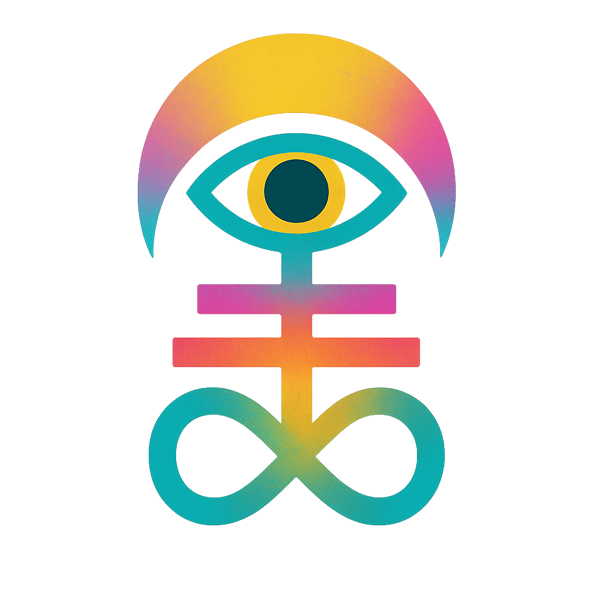 | 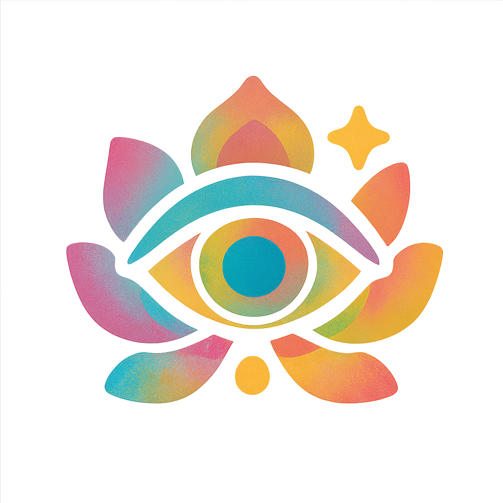 |
| **l-ajna** | **l-pentagram** | **leviathan** | **lotus** |
|  |  |  |  |
| **meso** | **sufi** | **triquetra** | **tulpa** |
|  | 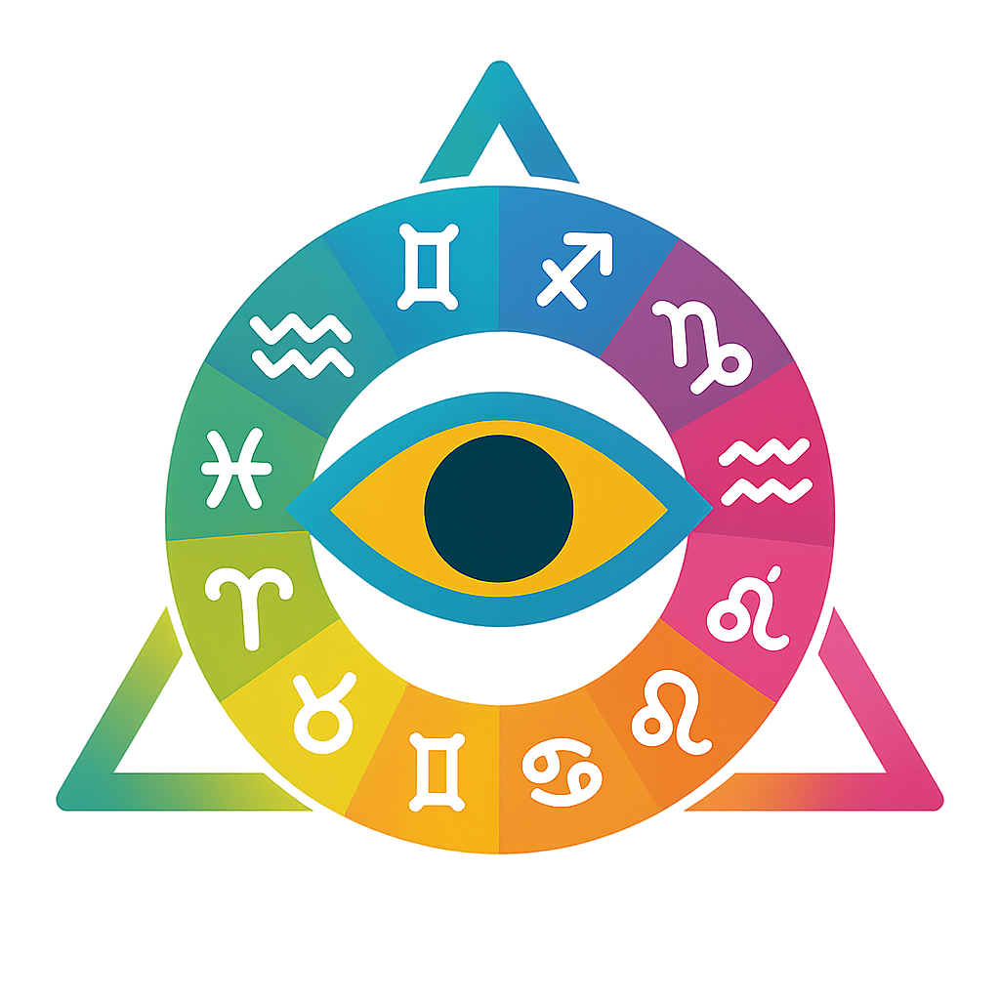 |  | 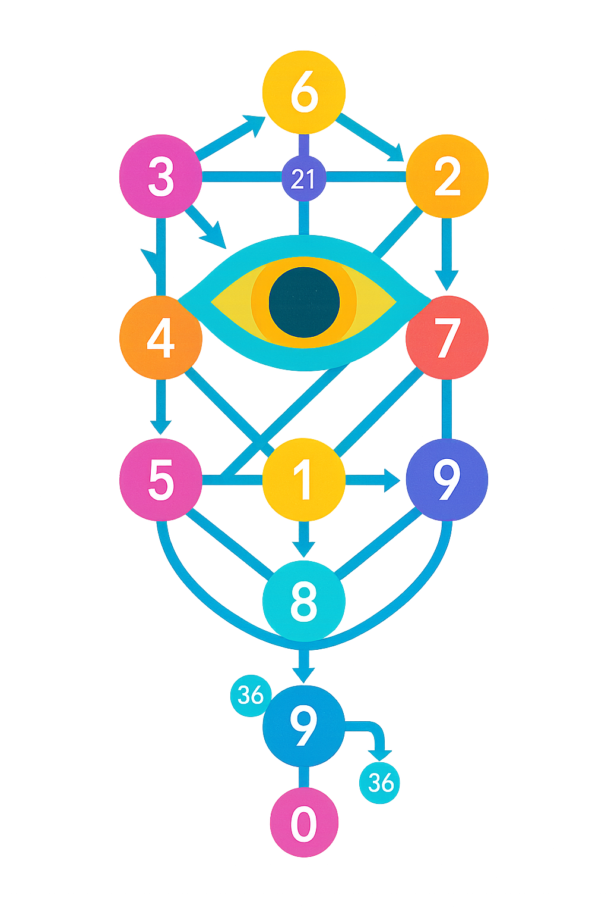 |
| **yantra** | **zodiac** | **rosicrucian** | **numogram** |

## Usage

All icons available in multiple formats:
- **PNG** - Original source files
- **ICO** - Windows icons (256x256 and multi-size)
- **SVG** - Scalable vector graphics

Find converted files in the `icons/` folder.

## License

Licensed under [CC BY 4.0](https://creativecommons.org/licenses/by/4.0/)

**Attribution:** Zach Battin (Æmexsomnus) • [github.com/SyntaxAsSpiral/esotericons](https://github.com/SyntaxAsSpiral/esotericons)
